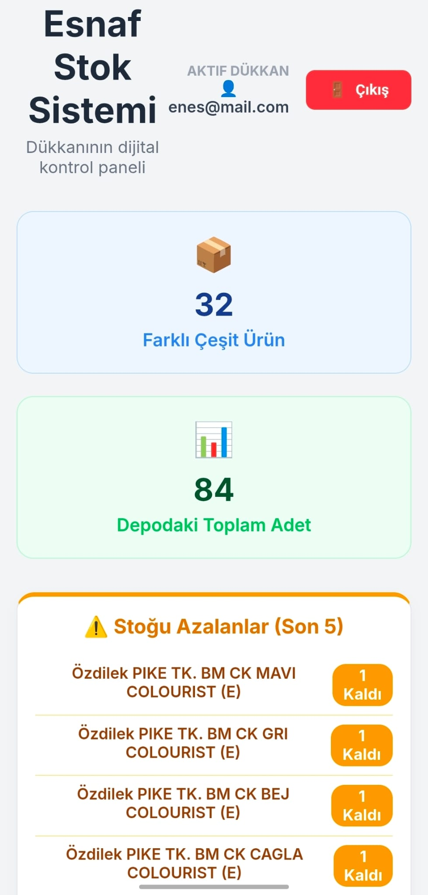

# 📦 Esnaf Stok Yönetim Sistemi (SaaS)

Esnaf ve küçük işletmelerin depo, stok ve satış süreçlerini dijitalleştiren; çoklu kullanıcı (Multi-tenant) mimarisine sahip, bulut tabanlı bir envanter yönetim sistemidir.

[](SİTENİN_CANLI_LİNKİNİ_BURAYA_YAZ)
[](https://www.python.org/)
[](https://fastapi.tiangolo.com/)
[](https://reactjs.org/)
[](https://supabase.com/)

---

# 🚀 Proje Hakkında

Esnaf Stok Yönetim Sistemi; küçük işletmelerin stok, satış ve depo yönetimini kolaylaştırmak amacıyla geliştirilmiş modern bir SaaS uygulamasıdır. Sistem sayesinde işletmeler ürünlerini dijital ortamda yönetebilir, barkod ile hızlı satış yapabilir ve stok hareketlerini gerçek zamanlı takip edebilir.

Proje, güvenli çoklu kullanıcı mimarisi sayesinde her işletmenin kendi verilerini izole şekilde yönetebilmesini sağlar.

---

# ✨ Öne Çıkan Özellikler

## 🏪 Çoklu Dükkan Mimarisi (Multi-Tenant SaaS)

- Her kullanıcıya özel izole veri alanı
- JWT Token tabanlı kimlik doğrulama
- Supabase RLS (Row Level Security) ile güvenli veri erişimi

## 📄 Akıllı Fatura Okuma (OCR)

- PDF veya fotoğraf üzerinden otomatik veri okuma
- Barkod, ürün adı ve adet bilgisi çıkarma
- Tesseract OCR ve PyMuPDF desteği

## 📷 Canlı Barkod Okuma

- Telefon veya bilgisayar kamerası ile barkod okutma
- Hızlı satış işlemleri
- Anlık stok sorgulama

## 📊 Gerçek Zamanlı Dashboard

- Azalan stokları görüntüleme
- Tükenen ürün uyarıları
- Toplam ürün ve satış istatistikleri

---

# 🛠 Kullanılan Teknolojiler

## Backend

- Python 3.11
- FastAPI
- Supabase (PostgreSQL)
- JWT Authentication
- PyTesseract
- PyMuPDF
- Render

## Frontend

- React.js
- React Router
- Axios
- HTML5-QRCode
- Vercel

---

# 📸 Ekran Görüntüleri

```md



```

---

# ⚙️ Kurulum ve Çalıştırma

## 1️⃣ Backend Kurulumu

```bash
cd backend

python -m venv venv
```

### Windows

```bash
venv\Scripts\activate
```

### Linux / MacOS

```bash
source venv/bin/activate
```

### Paket Kurulumu

```bash
pip install -r requirements.txt
```

### `.env` Dosyası

```env
DATABASE_URL=postgresql://...
SUPABASE_URL=https://...
SUPABASE_KEY=ey...
```

### Backend Başlatma

```bash
uvicorn main:app --reload
```

---

## 2️⃣ Frontend Kurulumu

```bash
cd frontend

npm install
```

### `.env` Dosyası

```env
REACT_APP_API_URL=http://localhost:8000
```

### Frontend Başlatma

```bash
npm start
```

---

# 🚧 Gelecek Planları (Roadmap)

- [ ] Mobil uyumlu kart tabanlı stok tasarımı
- [ ] Barkod okuma için hızlı yeniden tarama sistemi
- [ ] Bottom Navigation arayüzü
- [ ] PDF / Excel dışa aktarma özelliği
- [ ] Satış raporlama sistemi
- [ ] Günlük / haftalık analiz ekranları

---

# 👨‍💻 Geliştirici

**Enes Dolgun**

- Yazılım Mühendisliği Öğrencisi
- Backend & Full Stack Development
- Python / FastAPI / React

---

# 📜 Lisans

Bu proje MIT lisansı altında paylaşılmıştır.
